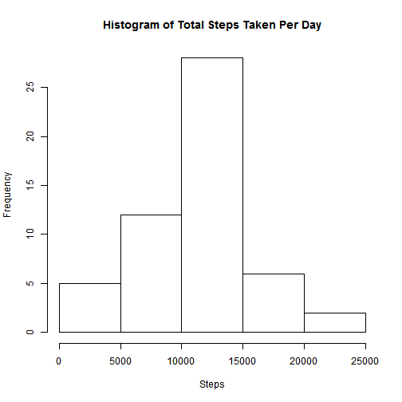
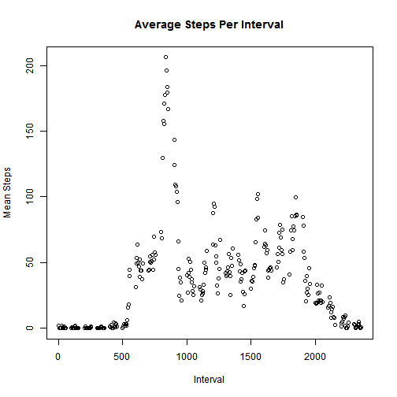
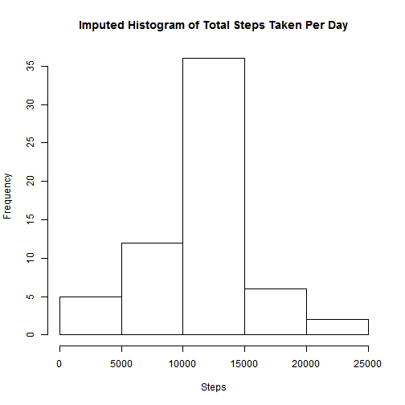
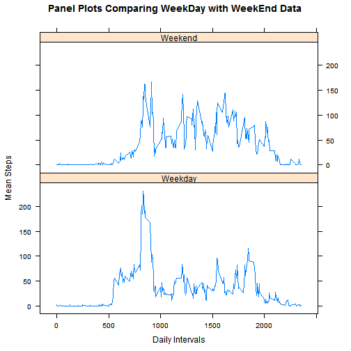

###Loading and preprocessing the data

This code  
1) Loads the data  
and  
2) Processes the data into a format suitable for analysis


```r
# read in data and save to activity variable
unzip("activity.zip") 
activity <- read.csv("activity.csv")
activity$steps<-as.numeric(activity$steps)
activity$interval<-as.numeric(activity$interval)

# Coverts activity date column to a date class
dates <- strptime(activity$date, "%Y-%m-%d")
activity$dates <- dates
uniqueDates <- unique(dates)
uniqueIntervals <- unique(activity$interval)
```


###What is mean total number of steps taken per day?

Missing values will be ignored for this part of the analysis.  
1.  Calculate the total number of steps taken per day  
2.  Histogram of the total number of steps taken per day  
3.  Report Mean and Median of the total number of steps taken per day  


```r
StepsPerDay <- aggregate(activity$steps, by=list(Category=activity$date), FUN=sum)

StepsPerDay$x <- as.numeric(StepsPerDay$x)
hist(StepsPerDay$x, main="Histogram of Total Steps Taken Per Day", xlab="Steps")
```

 

```r
MeanStepsPerDay <- as.character(mean(StepsPerDay$x,na.rm = TRUE))
MedianStepsPerDay <- as.character(median(StepsPerDay$x,na.rm = TRUE))
```

Mean Steps per day: 10766.1886792453  
Median Steps per day: 10765


###What is the average daily activity pattern?

1) Aggregates and makes a time series plot  
Then  
2) Determines and outputs the specific interval that contains the maximal mean number of steps


```r
# Aggregates and Graphs
StepsPerInterval <- aggregate(activity$steps, by=list(Category=activity$interval), FUN=mean,na.rm=TRUE)

plot(StepsPerInterval, xlab="Interval", ylab="Mean Steps", main="Average Steps Per Interval")
```

 

```r
# Determines maximal value
MaxStep <- StepsPerInterval[StepsPerInterval$x==max(StepsPerInterval$x),]
```

Interval with largest mean steps: 835  


###Imputing missing values

Tons of NAs in this dataset make some calculations tricky.  
  
1) Report how many NAs exist in the dataset  
2) Will use an imputation strategy of using the mean for that 5-min interval for each NA
3) Need to create a new dataset replacing NAs with those new values
4) Make a new histogram of the data and report mean and median.
5) Do these values differ from the estimates from the first part of the assignment?  
6) What is the impact of imputing missing data on the estimates of the total daily number of steps?  


```r
# part 1; Figures out how many NAs in steps column
TotalNA <- sum(is.na(activity$steps))

# part 2; Falculates the mean steps within each interval
StepsPerInterval <- aggregate(activity$steps, by=list(Category=activity$interval), FUN=mean,na.rm=TRUE)

# part 3; Makes new dataset replacing NA with value from the interval in part 2
activity2 <- activity
activity2$steps <- ifelse(!is.na(activity2$steps), activity2$steps, StepsPerInterval$x)

# part 4; Make a new histogram and report the mean and median.
StepsPerDay2 <- aggregate(activity2$steps, by=list(Category=activity2$date), FUN=sum)

StepsPerDay2$x <- as.numeric(StepsPerDay2$x)
hist(StepsPerDay2$x, main="Imputed Histogram of Total Steps Taken Per Day", xlab="Steps")
```

 

```r
MeanStepsPerDay2 <- as.character(mean(StepsPerDay2$x,na.rm = TRUE))
MedianStepsPerDay2 <- as.character(median(StepsPerDay2$x,na.rm = TRUE))
```

Total number of NAs in dataset: 2304 
Imputed Mean Steps per day: 10766.1886792453  
Imputed Median Steps per day: 10766.1886792453
  
5) The Mean number does not change with imputing data in this manner.  
6) The Median number increases slightly (to the mean) when imputing data in this fashion.  
Note that the biggest change here is the relative frequency (y-axis) of the histogram.  Not surprisingly, this increases as we now have more data to analyze and include on the histogram.


###Are there differences in activity patterns between weekdays and weekends?

Using the imputed data from the section just prior.
  
1) Create a new factor variable in the dataset with two levels, weekday and weekend using "weekdays" function  
2) Make panel plot to easily compare weekend with weekday activity


```r
# part 1; Convert the days of week to "Weekday" or "Weekend" factors
activity2$weekday <- weekdays(activity2$dates)
activity2$day <- ifelse(activity2$weekday == "Saturday" | activity2$weekday == "Sunday"  , "Weekend", "Weekday")
activity2$day <- as.factor(activity2$day)

WeekdayActivity <- activity2[activity2$day == "Weekday", ]
WeekendActivity <- activity2[activity2$day == "Weekend", ]

WeekdayMean <- aggregate(WeekdayActivity$steps, by=list(Category=WeekdayActivity$interval), FUN=mean,na.rm=TRUE)
WeekdayMean$day <- "Weekday"

WeekendMean <- aggregate(WeekendActivity$steps, by=list(Category=WeekendActivity$interval), FUN=mean,na.rm=TRUE)
WeekendMean$day <- "Weekend"

allactivity <- rbind(WeekdayMean,WeekendMean)

allactivity$day <- as.factor(allactivity$day)

# part 2; Panel Plot separated by Factor
library(lattice)
xyplot(allactivity$x~allactivity$Category|allactivity$day, 
  	main="Panel Plots Comparing WeekDay with WeekEnd Data",
   xlab="Daily Intervals", ylab="Mean Steps", 
   layout=c(1,2),type = "l", lty = 1)
```

 

Cool!  Slightly less morning activity on Weekends.  Sounds good to me.


